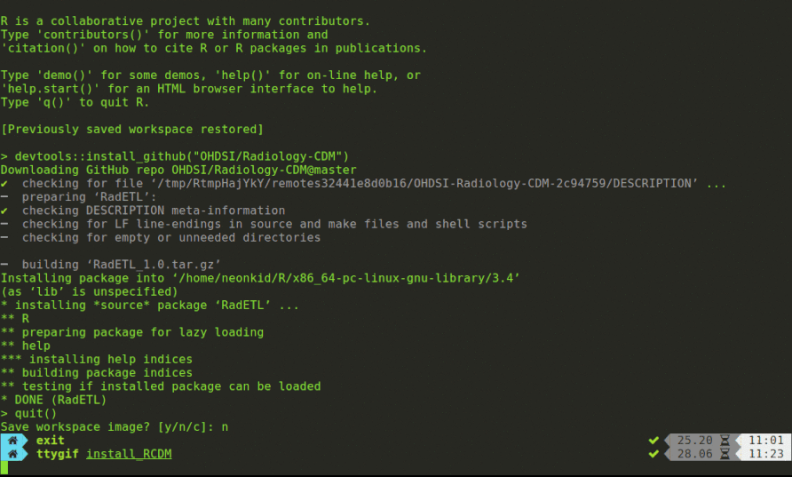

# Radiology CDM ETL Module

[](https://travis-ci.com/OHDSI/Radiology-CDM)


## Overview

Metadata extraction module of DICOM image format.

The main functions include the Pre and Post identification algorithms of CT and the ability to load them into the DBMS.

 

## Require Package

This package uses OHDSI's DatabaseConnector, oro.dicom package, and so on. In addition, some functions are implemented in Lambda, so you will also need the lambda.r package. In addition, You should also include the R6 package using object-oriented programming techniques such as Java and the C# language.

```
devtools, dplyr, oro.dicom, rapportools, oro.nifti, DatabaseConnector, SqlRender, R6, stringr, parallel, doSNOW
```


## How to install


```R
install_github("OHDSI/Radiology-CDM")
```


## Extraction sequence

1. Use the DcmFileModule class to extract metadata from a DICOM image file into an RDS file

   ```R
   # Example
   DFM <- DcmFileModule$new(path, savePathRoot)
   DFM$dcmToRDS(rootPathCount = 4, verbose = FALSE)
   ```

2. Read the extracted metadata RDS file using the Radiology CDM generation function. 
   (Using createRadiology family function)

   ```R
   # Example 
   
   # Create Radiology_Occurrence table for rds Path
   rdsPath <- "/home/ohdsi/Radiology/rdsfiles"
   
   # Create RadDB object,,
   # If using pararell, require pararell package
   RDB <- RadDB$new(core = parallel::detectCores() - 1)
   
   # Get Radiology_Occurrence table
   occur <- RDB$createRadiologyOccurrence(path = rdsPath)
   
   # Create Radiology_Image table for read RDS file
   rdsFile <- "/home/ohdsi/DICOM-header/header.rds"
   data <- readRDS(file = rdsFile)
   
   # Get Radiology_Image table
   img <- RDB$createRadiologyImage(data = data)
   ```

3. Loads data from the RDS file into the RDBMS. (Using DBMSIO Class. ***Option A***)

   ```R
   # Example
   dbms <- "sql server"
   user <- Sys.getenv("user")
   pw <- Sys.getenv("pw")
   server <- Sys.getenv("dbServer")
   
   # Connect DBMS...
   db <- DBMSIO$new(server = server, user = user, pw = pw, dbms = dbms)
   
   # df is radiology Data frame,,
   db$insertDB(dbS = databaseSchema, df = df)
   db$finalize()
   ```

4. Loads data from the RDS file into the RDBMS. (Using DatabaseConnector and SqlRender, ***Option B***)

   ```R
   # Example
   dbms <- "sql server"
   user <- Sys.getenv("user")
   pw <- Sys.getenv("pw")
   server <- Sys.getenv("dbServer")
   
   # Write connect information
   conDetails <- DatabaseConnector::createConnectionDetails(dbms = dbms, user = user, password = pw, server = server)
   
   # Connect DBMS
   con <- DatabaseConnector::connect(connectionDetails = conDetails)
   
   # insert tables...
   DatabaseConnector::insertTable(connection = con, tableName = paste0(databaseSchema, tbSchema), data = df)
   
   # if want disconnect
   DatabaseConnector::disconnect(connection = con)
   ```


## Example / Documentation

Documents and examples in the RadETL package can be loaded into the class and function names you want to provide the document using the question mark keyword after package installation.

```R
?DBMSIO
```

