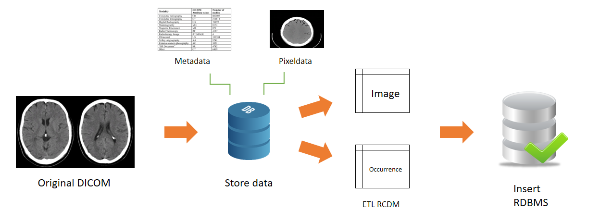

# Radiology CDM ETL Module

[](https://travis-ci.com/OHDSI/Radiology-CDM)
[](https://codecov.io/github/OHDSI/Radiology-CDM?branch=master)


## Overview

Metadata extraction module of DICOM image format.

The main functions include the Pre and Post identification algorithms of CT and the ability to load them into the DBMS.


## How to work



- Radiology-CDM extracts Metadata and Pixeldata from DICOM file, which is the original radiology image, and combines the data required for RCDM and stores it in DB format and converts it into CDM.

- Just copy and paste this code into your Rstudio!<br> All you have to do is just change 'path' and 'core' in DICOMHeaderList function.<br>RadiologyCDM function will read all of the DICOM files under the 'path' you've specified. <br>Now check the variable 'Radiology_Image_Table' and, 'Radiology_Occurrence_Table'!

```R
devtools::install_github('ABMI/Radiology-CDM')
library(RadiogyCDM)
DICOMList<-DICOMHeaderList('path to DICOM files', core = 4)
Radiology_Image_Table<-radiologyImageTable(DICOMList)
Radiology_Occurrence_Table<-radiologyOccurrenceTable(DICOMList)
```

## Extraction sequence

See the [wiki](https://github.com/OHDSI/Radiology-CDM/wiki/How-to-extract) for details on ETL methods.


## Example / Documentation

Documents and examples in the RadETL package can be loaded into the class and function names you want to provide the document using the question mark keyword after package installation.

```R
?DBMSIO
```
